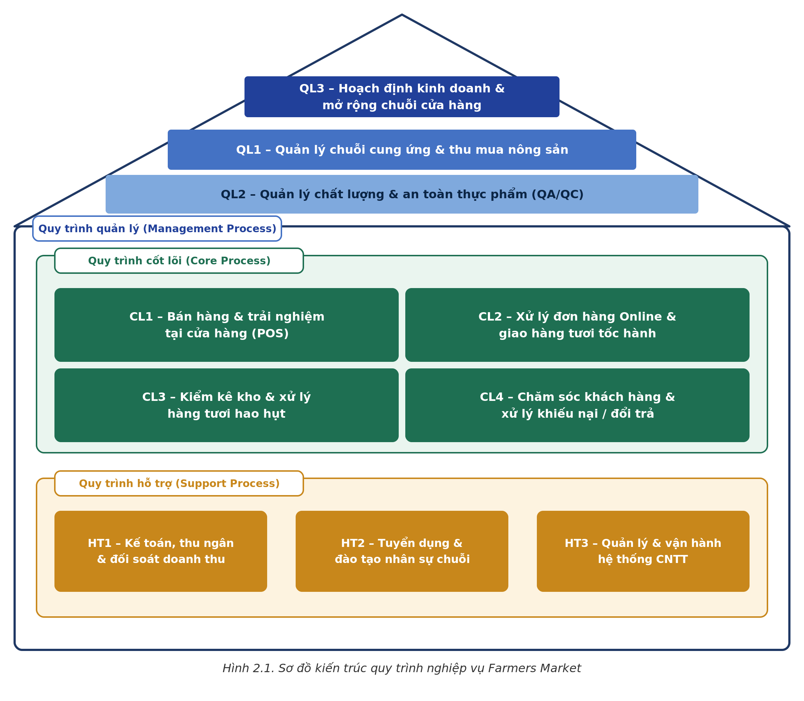
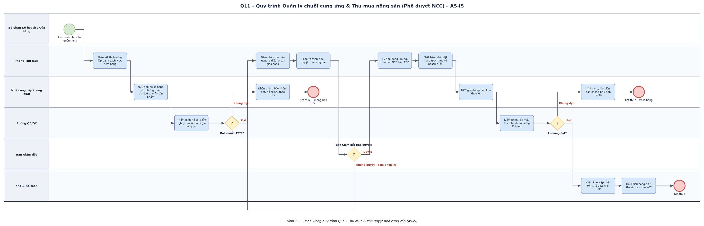
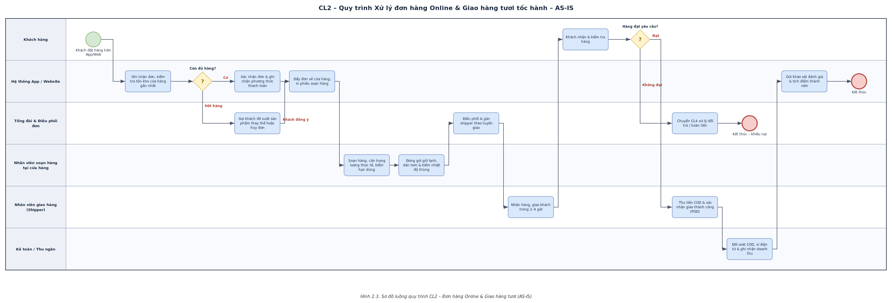

# Đồ án HT Quản trị Quy trình Nghiệp vụ – Farmers Market

**Sinh viên:** Nguyễn Đức Nghĩa – MSSV 25410262
**Nộp cho tuần 1:** Sơ đồ kiến trúc + luồng đi (trước họp tối thứ 2)

## Nội dung đã hoàn thành (đúng scope tuần 1)

1. **Sơ đồ kiến trúc ngôi nhà** 10 quy trình (Management – Core – Support)
2. **Sơ đồ luồng (BPMN swimlane) AS-IS** cho 2 quy trình được phân công:
   - QL1 – Quản lý chuỗi cung ứng & Thu mua nông sản (Phê duyệt NCC)
   - CL2 – Xử lý đơn hàng Online & Giao hàng tươi tốc hành

> Bảng danh mục 10 quy trình, phần diễn giải Chương 2 và Bộ 6 mục phân tích đầy đủ sẽ hoàn thiện **sau khi họp thống nhất kiến trúc tối thứ 2** — tránh phải sửa lại nếu nhóm chỉnh luồng.

## Sơ đồ kiến trúc



## Luồng QL1 – Thu mua & Phê duyệt NCC



6 lane: Kế hoạch/Cửa hàng → Thu mua → Nhà cung cấp → QA/QC → Ban Giám đốc → Kho & Kế toán. Hai điểm quyết định cần nhóm góp ý: (1) tiêu chí "đạt chuẩn ATTP" ở bước thẩm định hồ sơ, (2) ngưỡng phê duyệt của Ban Giám đốc.

## Luồng CL2 – Đơn hàng Online & Giao hàng tươi



6 lane: Khách hàng → App/Website → Tổng đài & Điều phối → Nhân viên soạn hàng → Shipper → Kế toán. Điểm cần góp ý: SLA giao "2–4 giờ" và nhánh xử lý khi hàng giao không đạt (nối sang CL4 của Ngọc Khánh).

## Cấu trúc thư mục

```
.
├── README.md
└── diagrams/
    ├── SoDo_KienTruc_QuyTrinh_FarmersMarket.drawio / .png / .svg
    ├── BPMN_QL1_ThuMua_PheDuyetNCC.drawio / .png / .svg
    └── BPMN_CL2_DonHangOnline_GiaoHangTuoi.drawio / .png / .svg
```

File `.drawio` mở tại https://app.diagrams.net (File → Open From → Device) để cả nhóm chỉnh sửa trực tiếp trong buổi họp.

## Việc còn lại (sau họp thứ 2)

- [ ] Chốt mã 10 quy trình + điều chỉnh luồng theo góp ý nhóm
- [ ] Bảng danh mục mô tả tóm tắt 10 quy trình
- [ ] Bộ 6 mục phân tích đầy đủ cho QL1 và CL2
- [ ] Xuất file Word Chương 2 hoàn chỉnh
